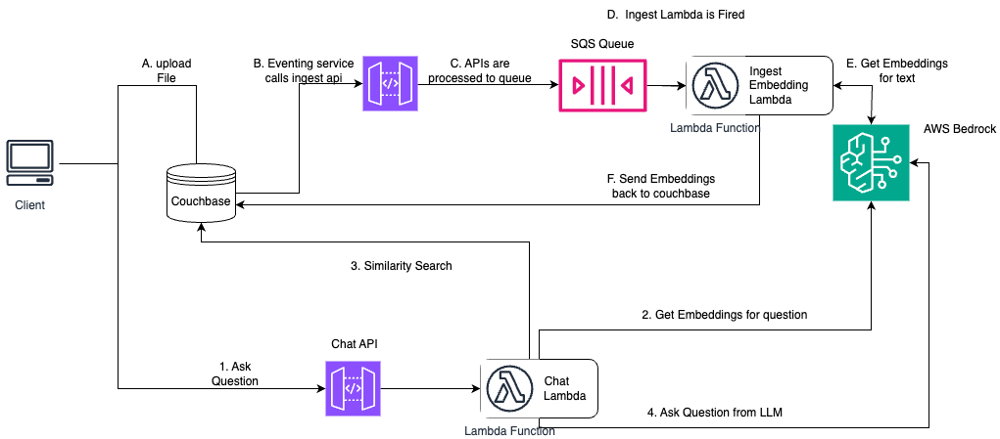

# PDF Chat App with Couchbase, AWS Bedrock with serverless architecture

## Introduction

This applications helps to create a Chat Application with a bot which knows about your uploaded PDF. We use RAG (Retrieval Augmented Generation) Framework for this purpose.

The Detailed tutorial is present [here](https://developer.couchbase.com/tutorial-bedrock-serverless-pdf-chat)

## Deploy AWS Backend

AWS Backend can be deployed using 

```bash
cdk deploy --all
```

## Architecture



## File Structure

### Frontend

Frontend is a simple streamlit app to utilize the API gateway endpoints. 
The frontend is present at `src/ui` folder

### Backend

Backend comprises of multiple components:

1. Couchbase Eventing - `src/cb_eventing`
2. AWS Lambdas for Ingestion and Chatting - `src/lambdas`
3. AWS CDK for Infrastructure - `cdk.json`, `chatCDK`, `ingestCDK`

