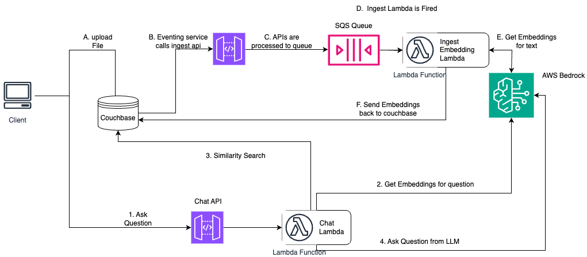

# PDF Chat App with Couchbase, AWS Bedrock, and Serverless Architecture

This application demonstrates how to build a chat application that allows users to interact with a bot knowledgeable about uploaded PDF documents. It utilizes a Retrieval Augmented Generation (RAG) framework.

For a detailed, step-by-step tutorial, please refer to the [Couchbase Developer Portal](https://developer.couchbase.com/tutorial-bedrock-serverless-pdf-chat).

## Architecture

The application employs a serverless architecture on AWS, leveraging services like AWS Lambda, API Gateway, and Bedrock, with Couchbase for data storage and eventing.



## Prerequisites

Before you begin, ensure you have the following installed and configured:

*   AWS CLI
*   Node.js and npm (for AWS CDK)
*   Python (version specified in `.python-version`)
*   Docker
*   An AWS account with appropriate permissions
*   A Couchbase Capella cluster

## Installation

The Detailed tutorial is present [here](https://developer.couchbase.com/tutorial-bedrock-serverless-pdf-chat)

## Deploy AWS Backend

Deploy the entire AWS backend infrastructure using the AWS CDK:

```bash
cdk deploy --all
```

This command will provision all the necessary AWS resources.

## File Structure

*   `src/`: Contains the application source code.
    *   `ui/`: Frontend Streamlit application.
    *   `cb_eventing/`: Couchbase Eventing function(s).
    *   `lambdas/`: AWS Lambda function code for ingestion and chat functionalities.
*   `chatCDK/`: AWS CDK stack for the chat-related infrastructure.
*   `ingestCDK/`: AWS CDK stack for the data ingestion infrastructure.
*   `app.py`: Main AWS CDK application file that synthesizes the stacks.
*   `cdk.json`: CDK configuration file.

## Usage

1.  **Upload PDFs:** Use the provided mechanism to ingest PDF documents. The ingestion pipeline will process these documents, generate embeddings, and store them.
2.  **Access the Chat UI:** Start the Streamlit frontend and navigate to the application URL.
3.  **Interact with the Bot:** Ask questions related to the content of the uploaded PDFs!